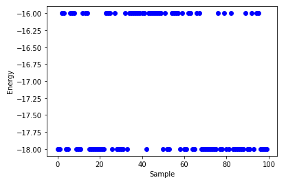
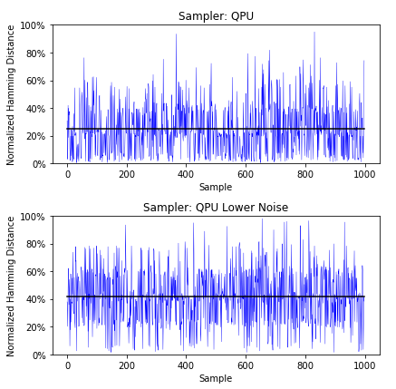
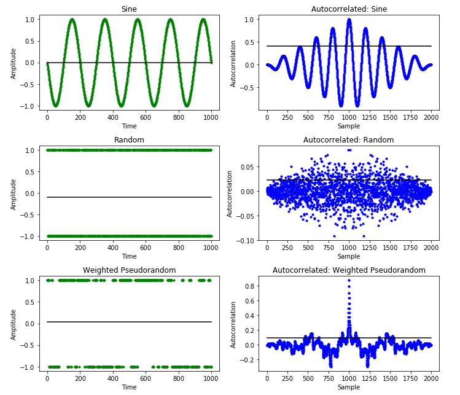
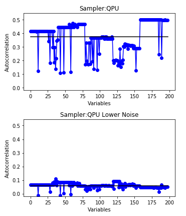
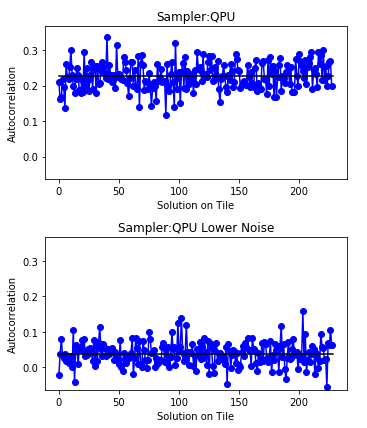
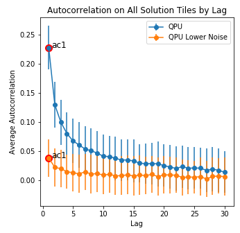

With the last previous-generation of D-Wave 2000Q quantum computer taken offline,
only lower-noise D-Wave 2000Q quantum processing units (QPU) are available now
in [Leap](https://cloud.dwavesys.com/leap/).
The *Diverse Solutions* Jupyter Notebook, which compared the two, has
been archived here as a webpage that presents the output of a typical execution.

# Archived Jupyter Notebook: Diverse Solutions (Using a Lower-Noise QPU)
This notebook makes use of D-Wave's 2019 breakthrough in quantum device
fabrication&mdash;its lower-noise technology for the quantum processing unit
(QPU)&mdash;to provide some tools and demonstrate techniques that can help your
quantum applications find better, more robust solutions to hard problems.

1. [Lower-Noise QPU](#Lower-Noise-QPU) gives a basic explanation of what noise
   is reduced in newer-generation QPUs.
2. [Basic Solution Analysis](#Basic-Solution-Analysis) shows some quick and
   simple ways to examine problem solutions.
3. [Analysis with Hamming Distance](#Analysis-with-Hamming-Distance) demonstrates
   a simple tool for analyzing solutions.
3. [Analysis with Autocorrelation](#Analysis-with-Autocorrelation) explains a
   more powerful tool, autocorrelation, and demonstrates its use through a
   comparison of results between the newer and previous generation of QPUs.

The D-Wave quantum computer solves binary quadratic models (BQM), the Ising model
traditionally used in statistical mechanics and its computer-science equivalent,
the quadratic unconstrained binary optimization (QUBO) problem. These formulations
can express a [wide range](https://arxiv.org/abs/1302.5843) of hard optimization
and constraint satisfaction problems, for example, such as job-shop scheduling,
protein folding, and traffic-flow optimization.

For applications in such fields to be successful may require diverse solutions,
which enable the application to respond to changes in the environment (problem
conditions). Additionally, a diverse set of solutions may reflect and enable
analysis of structural characteristics of the problem.

For the basics of solving problems on a quantum computer, see
[Ocean Software documentation](https://docs.ocean.dwavesys.com/en/stable/). For
more detailed information on posing problems and improving solutions, see
[D-Wave Problem-Solving Handbook](https://docs.dwavesys.com/docs/latest/doc_handbook.html).

**New to Jupyter Notebooks?** JNs are divided into text or code cells. Pressing
the **Run** button in the menu bar moves to the next cell. Code cells are marked
by an "In: \[\]" to the left; when run, an asterisk displays until code
completion: "In: \[\*\]".

# Lower-Noise QPU
Quantum computers exploit such quantum phenomena as entanglement and tunneling
to speed up the search for solutions to hard problems. Quantum states are highly
susceptible to interaction with the environment&mdash;qubits require isolation
from their surroundings.

The D-Wave system keeps the QPU at a temperature below 15 mK (near absolute zero)
and employs advanced radio frequency (RF) and  magnetic shielding against
electromagnetic interference. However, the chip itself&mdash;for example,
electrons in the chip wires&mdash;is a source of noise. The new generation of
QPUs improves the isolation of the qubits from noise originating in the chip
itself.

How does D-Wave's technological progress in fabricating qubits affect
applications solving real-world problems? A recent whitepaper,
[Improved coherence leads to gains in quantum annealing performance](https://www.dwavesys.com/sites/default/files/14-1037A-A_Improved_coherence_leads_to_gains_QA_performance.pdf),
demonstrates a 25x performance improvement in the lower-noise QPU for the
spin-glass problems of D-Wave's
[2018 Science article](https://science.sciencemag.org/content/361/6398/162.full.pdf).


You can learn more about D-Wave's lower-noise technology in the whitepaper
[Probing Mid-Band and Broad-Band Noise in Lower-Noise D-Wave 2000Q Fabrication Stacks](https://www.dwavesys.com/sites/default/files/14-1034A-A_Probling_noise_in_LN_2000Q_fabrication_stacks.pdf).

## Solver Availability
This subsection checks whether you have access to the latest-generation solver
by querying solver property `lower_noise`---see the
[Solver Properties and Parameters guide](https://docs.dwavesys.com/docs/latest/doc_solver_ref.html)
for a description of QPU properties.

The cell below uses Ocean software's
[dwave-system](https://docs.ocean.dwavesys.com/en/stable/docs_system/sdk_index.html)
`DWaveSampler()` to set up two connections to D-Wave solvers, one of which is to
a lower-noise QPU.

```
from dwave.system.samplers import DWaveSampler
from dwave.cloud.exceptions import *

try:
    sampler_qpu = DWaveSampler(solver={'lower_noise': False, 'qpu': True})
    sampler_ln = DWaveSampler(solver={'lower_noise': True, 'qpu': True})

    samplers = {'QPU': sampler_qpu, 'QPU Lower Noise': sampler_ln}
    print("Connected to QPU {} and lower-noise QPU {}.".format(sampler_qpu.solver.id, sampler_ln.solver.id))
except SolverNotFoundError:
    print("Currently a pair of solvers are unavailable for sections comparing QPU technologies. Try those examples later.")
```

    Connected to QPU DW_2000Q_2_1 and lower-noise QPU DW_2000Q_5.

# Basic Solution Analysis
The standard practice in solving problems on a quantum computer includes multiple
reads&mdash;quantum computers are probabilistic so it's essential to request
multiple samples. For some problems, the best answer returned is sufficient.

This section demonstrates some basic analysis to help you better understand and
possibly improve solutions returned from the D-Wave quantum computer.

## A Small Random (RAN1) Problem
For simplicity, this section solves a small RAN1 problem: a graph with all node
biases set to zero and all edge weights assigned

with uniform
distribution. Such a problem might represent an expansion of the well-known
[maximum cut](https://en.wikipedia.org/wiki/Maximum_cut) NP-hard graph problem
or the problem of estimating structural imbalance for real-world social networks
demonstrated in the
[structural imbalance demo](https://cloud.dwavesys.com/leap/demos/socialnetwork/)
and its accompanying Jupyter Notebook.

The next cell uses a NetworkX graph generator that returns a random graph with
16 nodes of degree 3. Ocean software's
[dimod](https://docs.ocean.dwavesys.com/en/stable/docs_dimod/sdk_index.html) uses
it to create a RAN1
problem. Because node biases are zero, in its Ising formulation submitted to the
quantum computer,

,

coefficients 
are set to zero. To solve the RAN1 problem the D-Wave system
minimizes the remaining right-hand term,

,

where N is the number of nodes, quadratic coefficients,
,
representing the graph edge values, are set to

and the solution's spin variables

can have values -1 or +1.

```
import dimod
import networkx as nx

problem_graph = nx.random_regular_graph(3, 16)
bqm = dimod.generators.random.ran_r(1, problem_graph)

print("BQM created with {} nodes and {} couplers.".format(len(bqm), len(bqm.quadratic)))
```

    BQM created with 16 nodes and 24 couplers.

Plot the BQM representing the problem.

```
from helpers.draw import plot_bqm # To see helper functions, select Jupyter File Explorer View from the Online Learning page

plot_bqm(bqm)
```


Request 100 reads (samples) from the D-Wave system and print the best solution.

Mapping between the graph of the RAN1 problem to the D-Wave QPU's numerically
indexed qubits, is known as *minor-embedding*. A problem can be minor embedded
onto the QPU in a variety of ways and this affects solution quality and
performance. Ocean software provides embedding tools suited for different types
of problems; this example uses Ocean software's
[dwave-system](https://docs.ocean.dwavesys.com/en/stable/docs_system/sdk_index.html)
`EmbeddingComposite()`, a heuristic for automatic embedding.

```
from dwave.system import EmbeddingComposite

num_reads = 100

result = {}
result['QPU'] = EmbeddingComposite(sampler_qpu).sample(bqm, num_reads=num_reads, answer_mode='raw')

print("Best solution found: {}".format(result['QPU'].first.sample))
```

    Best solution found: {0: -1, 1: -1, 2: 1, 3: -1, 4: 1, 5: 1, 6: 1, 7: 1, 8: 1, 9: -1, 10: -1, 11: 1, 12: -1, 13: -1, 14: 1, 15: -1}

One typical way to examine results is to check the number of occurrences of the
best solutions (those with lowest energy in the Ising formulation). RAN1 problems
with more than a few variables can have many solutions (corresponding to multiple
ground states of the Ising formulation), so you may see single occurrences of
many solutions rather than multiple occurrences of a small number of solutions.

An energy plot is an easy way to quickly visualize the quality of solutions.

```
%matplotlib inline
import matplotlib.pyplot as plt

plt.plot(range(len(result['QPU'])), result['QPU'].record.energy, 'bo')
plt.ylabel("Energy")
plt.xlabel("Sample")
```



You can rerun the problem while varying parameters and see if your solutions can
be improved; for example:

* increase the `annealing_time`
* set `num_spin_reversal_transforms`

Typically for even a slightly larger graph problem, such as
`nx.random_regular_graph(5, 16)`, you should see differences over a small number
of reruns. For larger and harder problems, increasing `num_reads` might enable
you to find a useful solution. See a list of configurable parameters in the
[system documentation](https://docs.dwavesys.com/docs/latest/doc_solver_ref.html)
and learn about using them in the
[D-Wave Problem-Solving Handbook](https://docs.dwavesys.com/docs/latest/doc_handbook.html).
Depending on the requirements of your particular application, select parameters
that produce good, robust solutions within your constraints on time, memory, etc.

Automatically embedding a problem on the QPU is heuristic and usually includes
representing some variables with multiple qubits (a "chain"). Chain length can
strongly affect solution quality. You can try rerunning the problem to obtain a
better embedding or directly use Ocean software's
[minorminer](https://docs.ocean.dwavesys.com/en/stable/docs_minorminer/source/sdk_index.html)
embedding tool to improve the embedding.

You might also try more advanced techniques such as changing the anneal schedule
or using reverse anneal, as demonstrated in other Leap Jupyter Notebooks.

# Analysis with Hamming Distance
The [Hamming distance](https://en.wikipedia.org/wiki/Hamming_distance) between
two samples is the number of variables with different values. This section shows
how it can be used to characterize some aspects of your solutions.

Below is a simple function for calculating Hamming distance. The calculation is
normalized (the number of changed variables is divided by the number of variables)
so comparisons between solutions with different numbers of variables is more
meaningful.     

```
def get_hamming_distance(x1, x2):    # x1, x2 are NumPy arrays
    return np.sum(x1 != x2)

def normalized_hamming_distance(sols):
    sols = np.array(sols)
    hd = np.true_divide(np.array([get_hamming_distance(x1, x2) for x1, x2 in zip(sols, sols[1:])]), np.shape(sols)[1])
    return [hd, np.mean(hd)]
```

The maximum Hamming distance, one, occurs if all variables flip in value between
consecutive samples; the minimum distance, zero, occurs if no variable changes
value between two consecutive samples.

For some simple problems the QPU might find the global minimum on each read, in
which case the Hamming distance is rightly zero. However, for problems with a
more rugged energy landscape, with many local minima, it is expected that
multiple reads produce multiple solutions, possibly including a global minimum.
A wider exploration of the landscape likely has higher Hamming distances.


To see a simple example, apply the Hamming-distance function to a 4-bit series
with increasing numbers of bit flips:

```
import numpy as np
min_to_max_4 = [np.roll(np.unpackbits(np.array([15], dtype=np.uint8)), -s0)[0:4].tolist() for s in range(1,5) for s0 in (0, s)]
hamming_distance = normalized_hamming_distance(min_to_max_4)
for i in range(4):
    print("Between {} and {} the normalized Hamming distance is {:.2f}".format(min_to_max_4[2*i], min_to_max_4[2*i+1], hamming_distance[0][2*i]))
```

    Between [0, 0, 0, 0] and [0, 0, 0, 1] the normalized Hamming distance is 0.25
    Between [0, 0, 0, 0] and [0, 0, 1, 1] the normalized Hamming distance is 0.50
    Between [0, 0, 0, 0] and [0, 1, 1, 1] the normalized Hamming distance is 0.75
    Between [0, 0, 0, 0] and [1, 1, 1, 1] the normalized Hamming distance is 1.00

### A Larger RAN1 Problem
As noted in the previous section, minor-embedding can significantly affect
solution quality. The example in this section creates a large RAN1 problem that
is identical on two QPUs.

It first creates a graph, `graph_cn16_shared`, that represents the nodes and
edges common to both QPUs' working graphs. Each QPU has a slightly different
graph from the canonical Chimera or Pegasus graphs that structure D-Wave QPU
qubits (due to fabrication yields that are typically slightly lower than 100%).
Using only these common nodes and edges, it then creates a smaller graph,
`graph_cn5_shared`, for a selected number of Chimera unit tiles: CN5 represents
a five by five lattice. Ocean software's
[dimod](https://docs.ocean.dwavesys.com/en/stable/docs_dimod/sdk_index.html)
`StructureComposite()` represents the QPUs as sampler with the shared CN5 graph.


```
from dimod import StructureComposite
from dwave.system import common_working_graph
import dwave_networkx as dnx

cnx = 5 # 5 Chimera (bipartite K_4,4 graph) cells
graph_cn16_shared = common_working_graph(sampler_qpu.adjacency, sampler_ln.adjacency)
graph_cn5_shared = common_working_graph(dnx.chimera_graph(cnx), graph_cn16_shared)

sampler_cn5_qpu = StructureComposite(sampler_qpu, graph_cn5_shared.nodes, graph_cn5_shared.edges)
sampler_cn5_ln = StructureComposite(sampler_ln, graph_cn5_shared.nodes, graph_cn5_shared.edges)
samplers = {'QPU': sampler_cn5_qpu, 'QPU Lower Noise': sampler_cn5_ln}

bqm = dimod.generators.random.ran_r(1, graph_cn5_shared)

print("BQM created with {} nodes and {} couplers.".format(len(bqm), len(bqm.quadratic)))
plot_bqm(bqm)
```

BQM created with 198 nodes and 466 couplers.


You can now run the problem on both QPUs and plot Hamming distances. Black lines
represent average values.

Note that this and following cells also show the QPU time used to solve the
problem because (a) ways of improving solutions discussed in sections below may
require longer run  times and (b) you may want to experiment yourself with
changing parameters in this notebook with knowledge of the cost in QPU usage.  

```
from helpers.draw import plot_hamming # To see helper functions, select Jupyter File Explorer View from the Online Learning page

num_reads = 1000

hamming_distance = {}
result = {}
for system, sampler in samplers.items():  
    result[system] = sampler.sample(bqm, num_reads=num_reads, answer_mode='raw', auto_scale=False)
    hamming_distance[system] = normalized_hamming_distance(result[system].record.sample)

print("QPU time used: {} microseconds.".format(sum(result[system].info['timing']['qpu_access_time'] for system in samplers)))
plot_hamming(hamming_distance)
```

    QPU time used: 497129 microseconds.



Typically, the lower-noise QPU explores more of the solution landscape for such
a problem; for most runs you see higher Hamming distances.

Due to the probabilistic nature of quantum computers, it can happen that
low-probability solutions are returned for some problem submissions. How do you
reduce the likelihood of mistaking these as representative samples for your
problem? Try to always set high numbers of reads. The cost of increasing the
number of reads is usually not a significant part of the overall solution budget
(time to prepare, submit, solve, and translate back to problem space). Here,
1000 reads are requested.

# Analysis with Autocorrelation
You do not need a deep understanding of
[Autocorrelation](https://en.wikipedia.org/wiki/Autocorrelation) to understand
this section and make use of the demonstrated methods. For the purpose of this
section it's enough to know that it is a formula that can find patterns in
signals; for example, a word in a stream of audio. This means that it can provide
information on the randomness of a time series of samples. In general,
autocorrelation on a signal,
,
produces a series of k values, each of which represents the sum of the signal
multiplied by a shifted copy of itself,
.

This section provides a simple example of autocorrelation to help you form an
intuitive grasp of its results that is sufficient for basic analysis of samples.
It then demonstrates its use on solutions returned from two D-Wave systems. You
can use the tool to gain insight into the quality of your solutions.

The `autocorrelate` function defined below uses
[NumPy's correlate function](https://numpy.org/doc/stable/index.html) to
calculates two values of interest:

* `ac1`: autocorrelation for a time lag of 1. This value represents the
  multiplication of the signal by a copy of itself shifted by one time unit (here
  a shift of one sample). This value of the autocorrelation series typically
  represents a significant part of the predictivity of the past's influence on
  the signal's current value; i.e. it expresses the likelihood that the current
  sample repeats the previous one, at least partly. This is shown below in this
  section.
* `ac0`: autocorrelation for all time lags with the value for zero lag removed
  (the function defined here normalizes the input signal&mdash;at zero lag a
  normalized signal multiplied by itself always has a value of one).

```
import pandas as pd
def autocorrelate(signals):
    df_columns = ["Signal", "ac", "ac1"]
    row = []
    for sig_name, sig_data in signals.items():
        if np.std(sig_data) == 0:
            print("Dropping constant signal {}. Increase the number of samples (reads) for this problem.".format(sig_name))
            ac1 = np.NaN
            ac = np.full(len(sig_data)-2, np.NaN)
        else:
            normalized_signal = np.true_divide((sig_data - np.mean(sig_data)), np.std(sig_data))
            ac0 = np.true_divide(np.correlate(normalized_signal, normalized_signal, mode='full'), len(normalized_signal))
            ac1 = ac0[np.argmax(ac0, axis=0)+1]
            ac = np.delete(ac0, np.argmax(ac0, axis=0))
        row.append([sig_name, ac, ac1])
    return pd.DataFrame(row, columns=df_columns)
```

## A Simple Example
This subsection uses the autocorrelation function on three simple signals to
provide intuition on what you might learn by applying it to solutions of your
problem.

The three signals are:

* Sine function. For this signal&mdash;the quintessential repetitive
  pattern&mdash;you can accurately predict future values after minimal amplitude
  measurements. Autocorrelation is expected to return a high value.
* Random signal of uniformly selected
  
  values. This signal should ideally
  return zero autocorrelation; regardless of how long you measure it, you cannot
  accurately predict the next value. In reality, it returns low autocorrelation
  because given a finite signal of sufficient length, random data can be
  interpreted as being part of some repetitive pattern.
* Weighted pseudo-random signal, where bit i depends to a high degree on
  bit i-1 and to a lower degree on bit i-2. This signal falls in between the
  previous two in its degree of randomness. Following subsections will show that
  such a signal can be helpfully used as a mental model for some behavior of
  returned samples.    

```
length = 1000
x_sin = np.sin(np.linspace(-5*np.pi, 5*np.pi, length))
x_rand = np.random.choice([-1, 1], size=length)
x_weighted_rand = [np.random.choice([-1, 1]), np.random.choice([-1, 1])]
for t in range(2, length):
     x_weighted_rand.append(np.random.choice([1, -1], 1, p=[0.5 + 0.4*x_weighted_rand[t-1] + 0.05*x_weighted_rand[t-2],
                                                            0.5 - 0.4*x_weighted_rand[t-1] - 0.05*x_weighted_rand[t-2]])
                                                            .item())
signals = {'Sine': x_sin, 'Random': x_rand, 'Weighted Pseudorandom': x_weighted_rand}
```

  Calculate autocorrelation and then plot the results.

```
autocorrelation = autocorrelate(signals)

for ind, row in autocorrelation.iterrows():
    print("{} signal has autocorrelation {:.4f}".format(row.Signal, row.ac1))
```

    Sine signal has autocorrelation 0.9995
    Random signal has autocorrelation -0.0176
    Weighted Pseudorandom signal has autocorrelation 0.8768

```
from helpers.draw import plot_sig_ac # To see helper functions, select Jupyter File Explorer View from the Online Learning page
plot_sig_ac(signals, autocorrelation)
```



Note the difference in the results between the random and weighted pseudo-random
signal. Such a difference is the focus of the next examples that examine samples
from the two generations of QPU.

## Autocorrelation on Variables
This example calculates autocorrelation on variables of the CN5 RAN1 problem of
the previous section and compares averages across the two QPUs.

```
bqm = dimod.generators.random.ran_r(1, graph_cn5_shared)
print("BQM created with {} nodes and {} couplers.".format(len(bqm), len(bqm.quadratic)))
```

    BQM created with 198 nodes and 466 couplers.

```
num_reads = 1000

result = {}
autocorrelation = {}
for system, sampler in samplers.items():  
    result[system] = sampler.sample(bqm, num_reads=num_reads, answer_mode='raw', auto_scale=False)
    autocorrelation[system] = autocorrelate({var: np.array(result[system].record.sample)[:,var] for var in range(len(bqm))})

print("QPU time used: {} microseconds.".format(sum(result[system].info['timing']['qpu_access_time'] for system in samplers)))
for sampler in samplers.keys():
    print("Average autocorrelation of variables on {} is {:.3f}".format(sampler, autocorrelation[sampler].ac1.mean(axis='index')))
```

    QPU time used: 497156 microseconds.
    Average autocorrelation of variables on QPU is 0.373
    Average autocorrelation of variables on QPU Lower Noise is 0.059

Plot the results. Black lines represent averages across all variables.

```
from helpers.draw import plot_ac1 # To see helper functions, select Jupyter File Explorer View from the Online Learning page
plot_ac1(autocorrelation, "Variables")
```



Typically, over many RAN1 problems, the lower-noise QPU shows lower
autocorrelation. Similar to the weighted pseudo-random signal of the first
subsection, variables have a slight tendency to repeat the values of the previous
sample. This is partly due to the qubits, which represent the problem variables,
being realized in a physical (real-world, noisy) device. The qubits in D-Wave's
lower-noise QPU act more like ideal qubits.

However, with RAN1 problems it is difficult to know whether a particular
variable's higher likelihood of repeating its previous state is due to such
outside influence or to that state being part of a good solution to the problem.
If you run a simple problem such as that of the
[Basic Solution Analysis](#Basic-Solution-Analysis) section with a small number
of variables and many reads (samples), variable values repeat because the QPU
correctly returns the problem's small set of solutions.

## Autocorrelation on Solutions
The previous subsection looked at autocorrelation for individual variables
(qubits); this subsection looks at autocorrelation on the returned solutions.

Again the selected problem is simple:

for a  bipartite
graph (a Chimera cell).


This problem has two known solutions (ground states):

* [1, 1, 1, 1, -1, -1, -1, -1]
* [-1, -1, -1, -1, 1, 1, 1, 1].

Because the problem can be represented by a single Chimera tile, this example
uses Ocean software's
[dwave-system](https://docs.ocean.dwavesys.com/en/stable/docs_system/sdk_index.html)
`TilingComposite` to process the problem in parallel by tiling multiple copies
across the QPU.


Use the previously calculated CN16-sized graph of nodes and edges common to both
QPUs, `graph_cn16_shared`, and previously instantiated `StructureComposite()`
samplers, to embed copies of the 8-qubit problem in Chimera tiles with full
yield in both systems (that is, to solve the problem on tiles that have all
active qubits in both the QPUs).

```
from dwave.system import TilingComposite

tiled_sampler_qpu = TilingComposite(StructureComposite(sampler_qpu, graph_cn16_shared.nodes, graph_cn16_shared.edges), sub_m=1, sub_n=1)
tiled_sampler_ln = TilingComposite(StructureComposite(sampler_ln, graph_cn16_shared.nodes, graph_cn16_shared.edges), sub_m=1, sub_n=1)
samplers = {'QPU': tiled_sampler_qpu, 'QPU Lower Noise': tiled_sampler_ln}

print("Tiling {} copies of the 8-variable problem to both QPUs.".format(tiled_sampler_qpu.num_tiles))
```

    Tiling 228 copies of the 8-variable problem to both QPUs.

The next cell calculates autocorrelation for each copy of the solution; that is,
it measures the influence of the state of all qubits in a Chimera tile, which
represent the solution of sample i, on the state of those same qubits in the
subsequent sample i+1.

Typically the two grounds states constitute most the answers. Ideally, each
should constitute 50% of the samples distributed uniformly much like the uniformly
selected

values of `x_sin` in the simple example above. In reality
qubits have some imbalance. Additionally, the next states tend to repeat the
previous to some degree, though significantly less so for the lower-noise QPUs.

```
num_reads = 1000

result = {}
autocorrelation = {}
for system, sampler in samplers.items():
    result[system] = sampler.sample_ising({}, {edge: 1 for edge in list(dnx.chimera_graph(1).edges)}, num_reads=num_reads, answer_mode='raw')
    result_byte = np.divide(np.dot(result[system].record.sample, [1, 1, 1, 1, -1, -1, -1, -1]), 8)
    autocorrelation[system] = autocorrelate({problem: result_byte[num_reads*problem : num_reads*(problem+1)-1] for problem in range(sampler.num_tiles)})

print("QPU time used: {} microseconds.".format(sum(result[system].info['timing']['qpu_access_time'] for system in samplers)))
for sampler in samplers.keys():
    print("Average autocorrelation of solutions on {} is {:.3f}".format(sampler, autocorrelation[sampler].ac1.mean(axis='index')))
```

    QPU time used: 497114 microseconds.
    Average autocorrelation of solutions on QPU is 0.227
    Average autocorrelation of solutions on QPU Lower Noise is 0.038

Plot `ac1`&mdash;autocorrelation calculated between subsequent
solutions&mdash;for each of the parallel-processed eight-variable problems. Black
lines represent averages across all solutions.

```
plot_ac1(autocorrelation, "Solution on Tile")
```



Next, plot average autocorrelation values for a selected number, `time_lags`,
of shifts. Bars represent standard deviation across all solutions. A marker shows
the average `ac1` value.

Notice the resemblance to the weighted pseudo-random signal of the previous
subsection, which gave a higher weight to the directly preceding value and a
lower weight to the value preceding that one. The state of the variables (qubits)
in a sample has some dependence on the previous state and even some, but much
less, on earlier states, with past influence dropping strongly with time.

```
from helpers.draw import plot_ac_lag # To see helper functions, select Jupyter File Explorer View from the Online Learning page
time_lags = 30
plot_ac_lag(autocorrelation, time_lags)
```



## Reducing Autocorrelation
The system provides ways to reduce autocorrelation on the previous generation of
QPUs too; for example, you can set QPU parameter `reduce_intersample_correlation`
to True.

The next code cells submit the same RAN1 twice to the QPU and calculate the
average autocorrelation on some selected number of variables, `num_variables`,
for `reduce_intersample_correlation` set to True (RIC ON) and False (RIC OFF).

```
bqm = dimod.generators.random.ran_r(1, [sampler_qpu.nodelist, sampler_qpu.edgelist])
print("BQM created with {} nodes and {} couplers.".format(len(bqm), len(bqm.quadratic)))
```

    BQM created with 2038 nodes and 5955 couplers.

```
num_reads = 1000
num_variables = 25

result = {}
result['RIC OFF'] = sampler_qpu.sample(bqm, num_reads=num_reads, answer_mode='raw', auto_scale=False)
result['RIC ON'] = sampler_qpu.sample(bqm, num_reads=num_reads, answer_mode='raw', auto_scale=False,
                                      reduce_intersample_correlation=True)

autocorrelation = {}
for ric in result.keys():
    autocorrelation[ric] = autocorrelate({var: np.array(result[ric].record.sample)[:,var] for var in range(num_variables)})    
    print("For {}, average autocorrelation of variables is {:.3f}".format(ric, autocorrelation[ric].ac1.mean(axis='index')))
```

    For RIC OFF, average autocorrelation of variables is 0.889
    For RIC ON, average autocorrelation of variables is 0.090

There is a time cost to improving solutions this way. The QPU adds a delay
between successive sampling. The next cell compares run times.

```
for ric in result.keys():
    print("For {}, QPU time used: {} microseconds.".format(ric, result[ric].info['timing']['qpu_access_time']))
```

    For RIC OFF, QPU time used: 173063 microseconds.
    For RIC ON, QPU time used: 768063 microseconds.

A less time-costly method is to increase the `readout_thermalization` parameter,
which makes the QPU wait longer after each read to cool down.

Check the default and range of this parameter for your QPU.

```
print("QPU default cooling between reads is {} from a possible range of {}".format(sampler_qpu.properties["default_readout_thermalization"], sampler_qpu.properties["readout_thermalization_range"]))
```

    QPU default cooling between reads is 0 from a possible range of [0, 10000]

Rerun the same problem and compare autocorrelation on a selected number of variables for different values of the `readout_thermalization` parameter.

```
num_reads = 1000
num_variables = 25

autocorrelation = {}
result = {}
for delay in [10, 50, 100]:
    result[delay] = sampler_qpu.sample(bqm, num_reads=num_reads, answer_mode='raw', auto_scale=False,
                                       readout_thermalization=delay)
    autocorrelation[delay] = autocorrelate({var: np.array(result[delay].record.sample)[:,var] for var in range(num_variables)})    
    print("For readout_thermalization={} and QPU time {}, autocorrelation is {:.3f}".format(delay, result[delay].info['timing']['qpu_access_time'], autocorrelation[delay].ac1.mean(axis='index')))
```

    For readout_thermalization=10 and QPU time 183068, autocorrelation is 0.625
    For readout_thermalization=50 and QPU time 223068, autocorrelation is 0.493
    For readout_thermalization=100 and QPU time 273063, autocorrelation is 0.494

Typically, for longer `readout_thermalization` settings, solutions have lower
autocorrelation.

Try experimenting with the methods demonstrated in this notebook. There are
additional methods to improve solutions and best practices you should be familiar
with. For more detailed information on posing problems and improving solutions,
see the
[D-Wave Problem-Solving Handbook](https://docs.dwavesys.com/docs/latest/doc_handbook.html).

For an example of improved performance on the lower-noise QPU, see the whitepaper
[Improved coherence leads to gains in quantum annealing performance](https://www.dwavesys.com/sites/default/files/14-1037A-A_Improved_coherence_leads_to_gains_QA_performance.pdf).

Copyright &copy; 2021 D-Wave Systems, Inc

The software is licensed under the Apache License, Version 2.0 (the \"License\")
you may not use this file except in compliance with the License.
You may obtain a copy of the License at

    http://www.apache.org/licenses/LICENSE-2.0

Unless required by applicable law or agreed to in writing, software
distributed under the License is distributed on an \"AS IS\" BASIS,
WITHOUT WARRANTIES OR CONDITIONS OF ANY KIND, either express or implied.
See the License for the specific language governing permissions and
limitations under the License.

<a rel=\"license\" href=\"http://creativecommons.org/licenses/by-nc-sa/4.0/\"></a><br />This Jupyter Notebook is licensed under a <a rel=\"license\" href=\"http://creativecommons.org/licenses/by-nc-sa/4.0/\">Creative Commons Attribution-NonCommercial-ShareAlike 4.0 International License</a>"
